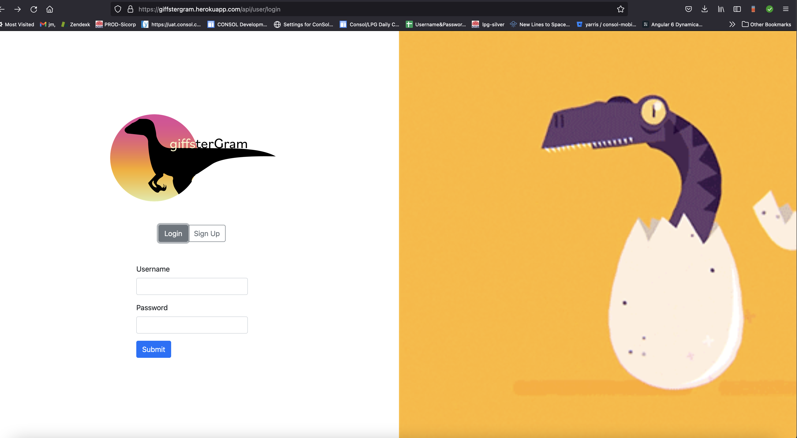

# Giffstergram

# Description
This is MVC application which allows your to users to signup and login to create there own  integrated self-made memes and share with others users , able to comment on the created memes.

# User Story

    AS an User
    I WANT to be able to communicate via 
    `integrated self-made animated` memes
    SO THAT we can leverage our pop-culture creativity to communicate

# Acceptance Criteria
    Given that I am user
    WHEN I visit the website
    THEN I am prompted to sign up or login
    WHEN I sign up
    THEN I create an account with a username, password and email address
    WHEN I login
    THEN I sign in with my username and password
    WHEN I am authenticated, I am at the homepage
    THEN I can see all posted gifs and can create and upload gifs
    WHEN I create a GIF
    THEN I can select a gif and also add a caption text to it
    THEN I can download it
    WHEN I upload a GIF
    THEN I can select which gif to upload and also add a title to it
    WHEN I am back at the homepage
    THEN I can see my recent gif posted
    WHEN I select a gif from the homepage
    THEN I am directed to its dedicated thread where I can see the title, comments and I can add my own comments

# Technologies
* JS
* Node.js
* Bootstrap
* Nodemon
* Jimp
* Bcrypt
* Gifwrap
* Handlebars
* Model-View-Controller
* dotenv
* MySQL
* Sequelize and session

 
  

# Links
[Heroku Link](https://giffstergram.herokuapp.com/)

